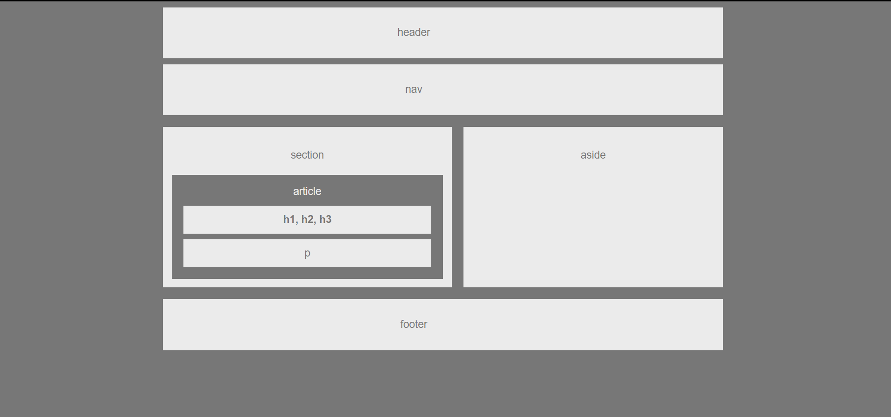

# HW-Wireframe

A simple demonstration of where html elements should be located within a webpage.

# Built With
- [HTML](https://developer.mozilla.org/en-US/docs/Learn/HTML)
- [CSS](https://developer.mozilla.org/en-US/docs/Web/CSS)

# Versioning
- [Github](https://github.com/)

# Authors
Jake Dudum

# Acknowledgments
- Darryl Tolentino for inspiration and idea bouncing

